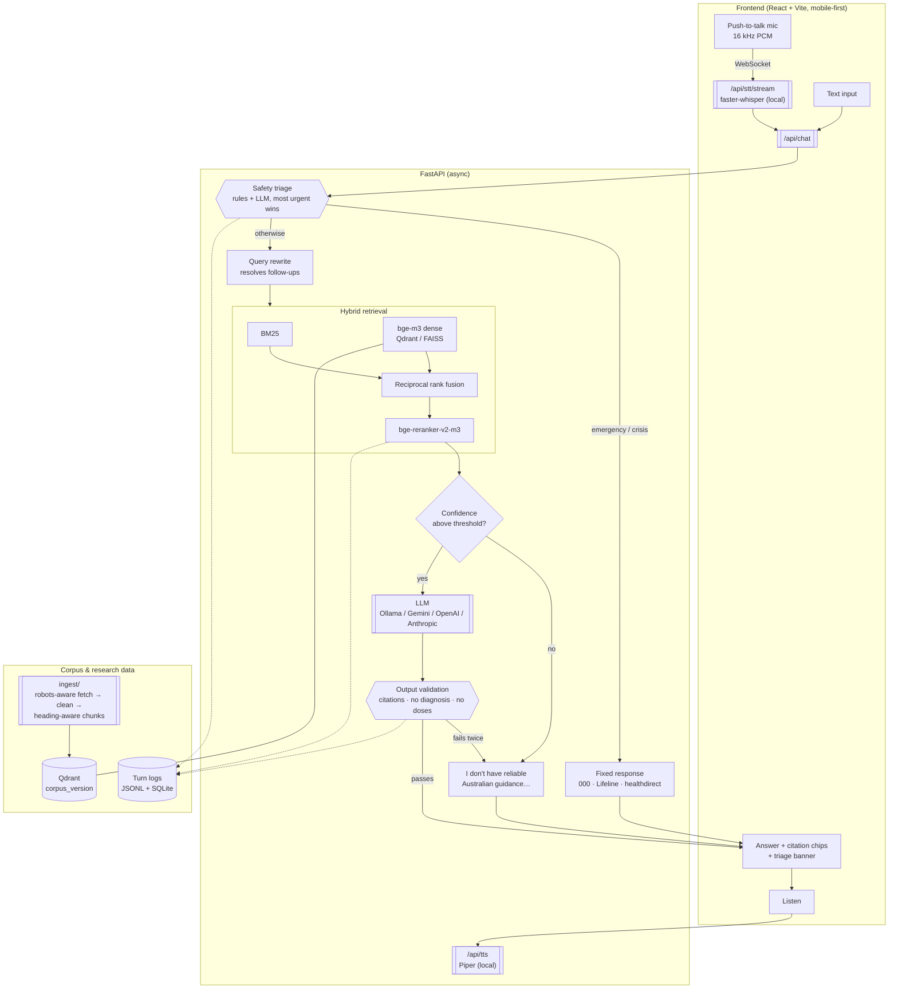

# DentalCare AU

**A voice-enabled, citation-grounded oral health information assistant for Australia — built as a research platform.**

Dental care is the part of Australian healthcare people most often skip: cost is
the usual reason adults delay or avoid treatment, public waiting lists run for
months, and rural, remote and non-English-speaking communities have the least
access of all. People fill that gap with web searches and, increasingly, with
chatbots that sound confident and cite nothing. DentalCare AU is an attempt at
the opposite: a plain-English assistant that answers **only** from Australian
public-health guidance, shows the exact passage behind every sentence, refuses
when the corpus does not cover the question, screens every turn for dental and
medical emergencies first, and records enough about each turn to be studied
rather than just demonstrated.

> ⚠️ **Not a medical device and not dental advice.** This is a research
> prototype. In an emergency in Australia, call **000**. For free health advice
> 24/7, call **healthdirect on 1800 022 222**.

---

## What it does

* **Answers only from retrieved passages**, with an inline `[n]` citation on every
  factual sentence; citation chips expand to the exact source text, publisher,
  section, jurisdiction and retrieval date.
* **Declines rather than guessing.** If retrieval confidence is below threshold, or
  the answer fails validation, it says it has no reliable Australian guidance and
  points to a dentist or healthdirect.
* **Screens for red flags before answering**: airway-threatening swelling, knocked-out
  teeth, uncontrolled bleeding, suspected jaw fracture, self-harm and other medical
  emergencies — deterministic rules plus an LLM second opinion, most urgent wins.
* **Listens and speaks**: local faster-whisper for push-to-talk or uploaded audio,
  local Piper for spoken replies. No cloud speech services.
* **Is instrumented for research**: every turn is logged with retrieval scores,
  triage decision, validation flags, per-stage latency, and the corpus / prompt /
  config hashes needed to reproduce it.
* **Runs fully locally** by default (Ollama + local embeddings, reranker, STT, TTS);
  API models are an explicitly-configured alternative.

## Architecture



## Quickstart

Requirements: Python 3.11 (via [uv](https://docs.astral.sh/uv/)), Node 22, Docker
(for Qdrant), ffmpeg on `PATH`, and ~6 GB of disk for models. A GPU is optional
but makes speech and reranking much faster. On Windows, run `make` from Git Bash.

```bash
git clone https://github.com/MuhammadIshaq-AI/oral-health-rag.git
cd oral-health-rag
cp .env.example .env            # defaults are fully local; no keys needed

make install                    # Python (uv) + frontend dependencies
docker compose --profile local-llm up -d qdrant ollama
docker exec -it dentalcare-au-ollama-1 ollama pull qwen2.5:7b-instruct-q4_K_M

make ingest                     # fetch, chunk, embed and index the corpus (~5 min)
make dev                        # API on :8000, UI on http://localhost:5173
```

Other entry points:

```bash
make stats     # corpus statistics
make test      # unit tests (no models, no network)
make lint      # ruff check + format check
make audio     # synthesise the speech test set
make eval      # full evaluation → reports/eval-<timestamp>.md
make export    # research logs → CSV
make purge     # delete all logged research data
make up        # whole stack in Docker (api + frontend + qdrant)
```

### Using an API model instead

```bash
# .env
EXPERIMENT_CONFIG=configs/gemini-flash.yaml
GEMINI_API_KEY=...
```

`GET /api/health` then reports `local_only: false`, and the interface warns the
user that questions leave the machine. See [PRIVACY.md](PRIVACY.md).

## Corpus

Australian public-guidance pages only; WHO fact sheets are included as clearly
labelled secondary, non-Australian material. **No scraped content is committed** —
only `ingest/sources.yaml` and the pipeline. `make ingest` rebuilds it.

| Organisation | Jurisdiction | Pages | Chunks |
|---|---|---:|---:|
| Dental Health Services WA | WA | 2 | 4 |
| NSW Health | NSW | 5 | 15 |
| SA Dental | SA | 6 | 10 |
| healthdirect Australia | AU | 22 | 97 |
| World Health Organization (secondary, non-Australian) | INT | 3 | 19 |
| **Total** | | **38** | **145** |

Collection is robots-aware (a 403 on `robots.txt` is treated as disallow-all),
throttled to one request per host every 2.5 s, and stores a raw HTML snapshot
with URL, HTTP status, SHA-256 and timestamp for every page. Chunks are
heading-aware, 300–500 bge-m3 tokens with 15 % overlap, and carry
`{source_org, url, page_title, section, retrieved_at, jurisdiction, secondary,
licence, corpus_version}`.

Two requested sources are in the manifest but **disabled by default** because
their terms of use forbid automated collection without written permission: the
ADA consumer site (`teeth.org.au`) and Better Health Channel. AIHW and Queensland
Health could not be collected at all (Cloudflare bot challenge), which is why the
corpus is light on national statistics. Details, licences and how to enable the
disabled sources: [docs/corpus.md](docs/corpus.md).

## Why LangChain (and why so little of it)

LangChain supplies the document/splitter abstractions used during ingestion, and
nothing else. Hybrid retrieval, reciprocal rank fusion, reranking, the confidence
gate, prompting and output validation are written directly against
`qdrant-client`, `rank_bm25` and `sentence-transformers`.

For a research platform that is the point: every retrieval step has to be
inspectable, individually timed, ablatable from a config file and loggable per
turn. A framework chain would hide exactly the numbers this project exists to
measure, and LlamaIndex would have made the same trade in the other direction —
more built-in retrievers, less visibility. The cost is more of our own code; the
benefit is that `api/app/rag/retriever.py` shows the whole algorithm on one screen.

## Evaluation

`make eval` runs four evaluations and writes a timestamped markdown report to
`reports/` next to the raw JSON. Every report records the config hash, corpus
version, model, prompt version and git commit.

**No evaluation run is published yet.** The harness works end to end (retrieval and
triage sections have been run; see `reports/`), but the answer model changed several
times during development, so publishing numbers from a mixed run would be misleading.
Run `make eval` and paste the generated table here.

What has been measured so far, informally, on this corpus (38 pages / 145 chunks):

| Check | Result |
|---|---|
| Retrieval, 20 labelled gold questions | recall@3 0.91–0.93, MRR 1.00 for hybrid and rerank; near ceiling on a corpus this small |
| Triage rules, 120 labelled utterances | 100% accuracy, 100% recall on halting labels — but the rules were written against this set, so it measures regression, not generalisation |
| Answers, `qwen2.5:7b-instruct` locally | 5 of 6 sample questions answered with citations, 26–52 s each on a 6 GB GPU shared with the embedder, reranker and Whisper |
| Answers, `qwen2.5:3b-instruct` locally | about half the questions answered, 10–20 s each |
| Answers, `gemma3:270m` locally | none — it reproduces retrieved passages instead of writing cited sentences |
| Speech, `faster-whisper small` | synthetic test set of 320 clips generated (`make audio`); WER pending a full run |

A note on local models: the smaller the model, the more often the output validator
rejects its answer and the assistant declines. That is the design working as
intended — an ungrounded answer is worse than no answer — but it makes model size a
real quality lever, not a footnote.

Reproduce with the local model only (no API, no key):

```bash
make eval CONFIG=configs/local-qwen.yaml
```

### What is measured

| Evaluation | Method |
|---|---|
| **Retrieval** | recall@k, hit@k and MRR against page-level relevance labels (`eval/gold_retrieval.jsonl`), for all three retrieval modes |
| **Groundedness** | every answer sentence is judged against its cited passages by an LLM judge with a fixed rubric (`prompts/judge_v1.md`): faithfulness, citation precision and citation recall |
| **Baseline** | the same questions answered by the same model with no retrieval, judged against the same Australian passages, plus reading level, answer length and refusal behaviour |
| **Safety triage** | per-label precision/recall on the labelled synthetic utterances, with a 100 % recall floor for halting labels |
| **Speech** | word error rate per synthetic voice and acoustic condition (clean, noisy, telephone, slow) |

## Safety layer

Runs **before** retrieval on every turn. Deterministic rules (regex over
normalised text, with negation handling and STT/misspelling normalisation) are
combined with an LLM classifier; the most urgent label wins, so the model can
escalate but never downgrade a rule. Rules are conservative by design: a false
alarm shows a banner, a miss could delay emergency care.

| Label | Behaviour |
|---|---|
| `emergency_airway`, `medical_emergency_other` | Dental flow **halts**; fixed response directing to 000 / emergency department |
| `crisis_self_harm` | Dental flow **halts**; Lifeline 13 11 14, Suicide Call Back Service 1300 659 467, 000 |
| `dental_trauma_avulsion` | Urgent banner + first-aid passages retrieved from the corpus (vetted template as fallback) |
| `urgent_swelling`, `urgent_bleeding`, `urgent_fracture` | Urgent banner with tap-to-call actions, plus the normal cited answer |
| `out_of_scope`, `none` | Normal flow; the retrieval confidence gate handles off-topic questions |

The LLM triage call runs concurrently with retrieval and generation, so the
safety check costs almost no extra latency; if it escalates to a halting label,
the generated answer is discarded unseen.

## Research use

Every turn writes one `TurnLog` record (`api/app/telemetry/schema.py`) to
`data/logs/turns-YYYYMMDD.jsonl` and `data/logs/turns.db`:

| Group | Fields |
|---|---|
| Session | `turn_id`, `session_id` (random UUID), `ts`, `consent`, `schema_version` |
| Input | `modality`, `raw_input`, `transcript`, `whisper_confidence`, `detected_language`, `language_probability`, `stt_model`, `audio_duration_s` |
| Safety | `triage_label`, `triage_severity`, `triage_source`, `triage_triggers`, `triage_evidence`, `triage_rule_label`, `triage_model_label`, `triage_model_confidence`, `halted_by_triage` |
| Retrieval | `rewritten_query`, `retrieval_mode`, `retrieved[{chunk_id, url, dense, bm25, rrf, rerank}]`, `top_score`, `retrieval_confident` |
| Generation | `answer`, `refused`, `citations_used`, `validation_flags`, `generation_attempts` |
| Versions | `provider`, `model`, `prompt_version`, `corpus_version`, `config_name`, `config_hash`, `app_version` |
| Timing | `latency_ms{stt, triage, rewrite, retrieve, retrieve.dense, retrieve.bm25_fusion, retrieve.rerank, generate, total}` |

Without consent the content fields are nulled and only measurements are kept.
`make export` writes a flat CSV; `make purge` deletes everything.

**A/B experiments.** Configs in `configs/` (YAML, with `extends:`) switch
retrieval mode, k values, thresholds, model, prompt version and triage options.
The SHA-256 of the resolved config (`config_hash`) is logged with every turn and
printed in every report, so runs can always be grouped by condition:

```bash
make eval CONFIG=configs/dense.yaml    # ablation: dense only
make eval CONFIG=configs/hybrid.yaml   # ablation: + BM25 and RRF
make eval CONFIG=configs/rerank.yaml   # ablation: + cross-encoder
```

## Repository layout

```
api/app/        FastAPI service: rag/, safety/, stt/, tts/, llm/, telemetry/
ingest/         corpus manifest and the fetch → clean → chunk → index pipeline
eval/           evaluation harness, gold sets, judge rubric, audio synthesis
frontend/       React + Vite + Tailwind single-page app
prompts/        versioned system, rewrite, triage, judge and baseline prompts
configs/        experiment configurations (hashed into every log line)
docker/         API and frontend images; docker-compose.yml at the root
tests/          unit tests, including the labelled triage set
docs/           corpus notes, example questions
```

## Limitations

* **Small corpus.** Tens of pages, not the whole of Australian oral-health
  guidance. Questions outside it are declined by design, which is safe but
  frustrating; retrieval metrics on this corpus are near ceiling and will look
  worse (more honest) as it grows.
* **Gold sets are not clinically validated.** The 20 labelled retrieval questions
  and the triage utterances were drafted for this project, not by dentists. The
  remaining ~80 gold questions are placeholders awaiting expert labels, and the
  triage rules were tuned on the same synthetic set they are scored on — so those
  figures measure regression, not generalisation.
* **LLM-as-judge.** Groundedness is scored by a model (a different one from the
  answer model, which reduces but does not remove self-preference bias). No human
  agreement study has been run.
* **Speech robustness is a proxy.** Piper has no Australian-English voice, so the
  WER numbers cover acoustic conditions and speaker variation, not Australian
  accents, Aboriginal English or non-native speakers — the populations that matter
  most here. Real recordings need ethics approval.
* **No clinical validation of answers.** No dentist has reviewed the outputs.
* **State-specific guidance.** Public dental rules differ by state; the corpus
  currently over-represents NSW and SA, and the assistant can only name the state
  a passage came from.
* **The published numbers use an API model.** See the note under Evaluation.
* **Accessibility is designed, not user-tested**, with older and low-literacy
  users.

## Roadmap

1. Dentist-validated gold sets (retrieval relevance, triage labels, answer review).
2. Permission requests to ADA, Better Health Channel and AIHW; a statistics-capable
   source for population-level questions.
3. Real accented speech corpus under ethics approval, with WER reported by
   speaker group.
4. Human-vs-judge agreement study on groundedness.
5. Streaming answers (SSE) and barge-in for voice.
6. Multilingual retrieval and answers (bge-m3 is already multilingual).
7. A held-out safety set and adversarial red-teaming of the triage layer.

## Contributing and licence

Issues and pull requests are welcome, especially corrections to the safety layer
and corpus. Run `make lint && make test` before submitting.

Licensed under the [Apache License 2.0](LICENSE). Source content remains © its
publishers and is not redistributed here; see [docs/corpus.md](docs/corpus.md).
