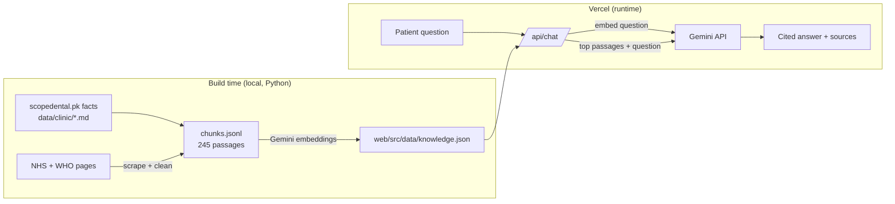

# Scope Dental Practice Islamabad — Patient Assistant (RAG)

A retrieval-augmented chatbot for **Scope Dental Practice, Islamabad**. It answers patient
questions **only** from the practice's own information and openly licensed NHS/WHO patient
guidance, with numbered, clickable citations. When the sources don't cover a question, such as
prices or hours that aren't published, it says so instead of guessing.

Everything is deployed as a single **Next.js app on Vercel**. The retrieval index is built ahead of
time and ships inside the app, so there is no separate backend server.



## How a question is answered

1. The browser sends the question, plus recent chat history kept in the tab, to `/api/chat`, a
   Vercel function.
2. The function embeds the question with `gemini-embedding-001` and compares it against the 245
   pre-embedded passages in `knowledge.json`, in memory.
3. It picks the most relevant **Scope Dental Practice** passages (only if relevant) and the top 5
   NHS/WHO passages.
4. Only those passages and the question go to **Gemini 3.6 Flash**. Its instructions are to
   answer from them alone and cite every sentence.
5. The answer and its source list return to the browser. Nothing is stored server-side.

## Stack

| Piece | Choice |
|---|---|
| Scraping and chunking (build time) | Python: `requests` + `trafilatura`, LangChain Markdown-aware splitter |
| Embeddings | `gemini-embedding-001`, 768 dimensions (passages: `RETRIEVAL_DOCUMENT`, questions: `RETRIEVAL_QUERY`) |
| Vector search | Cosine similarity over normalised vectors inside the Vercel function (245 passages, no database needed) |
| Chat model | `gemini-3.6-flash` via Gemini's OpenAI-compatible API, thinking disabled |
| App | Next.js 16 (App Router), Tailwind CSS v4, deployed on Vercel |

## Knowledge base and licensing

- **Scope Dental Practice**: `data/clinic/scope-dental-practice.md`. Only facts published on
  https://scopedental.pk: practice description, Dr Asfand Ali Khan and team, phone and WhatsApp,
  Instagram, and the Google Maps link. Address, opening hours, services and prices aren't
  published yet; see `data/clinic/README.md` to add them. © Scope Dental Practice.
- **NHS website content**: brushing, children's teeth, check-ups, treatments, tooth decay, gum
  disease, toothache, abscesses, ulcers, bad breath, mouth cancer, cold sores, oral thrush,
  dentures, whitening, dry mouth, grinding, wisdom teeth, root canals and teething. Contains public
  sector information licensed under the
  [Open Government Licence v3.0](https://www.nationalarchives.gov.uk/doc/open-government-licence/version/3/).
- **WHO fact sheets**: oral health, sugars and dental caries, noma. © World Health Organization,
  [CC BY-NC-SA 3.0 IGO](https://creativecommons.org/licenses/by-nc-sa/3.0/igo/) (non-commercial).

The source list lives in `rag/sources.py`. Every passage keeps its URL, publisher and licence.

## Run locally

```bash
cd web
cp .env.example .env.local        # set GEMINI_API_KEY (https://aistudio.google.com/apikey)
npm install
npm run dev                       # http://localhost:3000
```

## Update the knowledge base

Python is only needed to rebuild the data:

```bash
python -m venv .venv && .venv/Scripts/activate     # macOS/Linux: source .venv/bin/activate
pip install -r requirements.txt
cp .env.example .env                               # set GEMINI_API_KEY

python scripts/build_index.py        # scrape sources + read data/clinic/*.md -> data/chunks.jsonl
python scripts/export_web_index.py   # embed with Gemini -> web/src/data/knowledge.json
```

Commit the updated `web/src/data/knowledge.json` and redeploy. Typical edits:
- Add the address, opening hours or services to `data/clinic/scope-dental-practice.md`.
- Add or remove URLs in `rag/sources.py`.

## Evaluation

`eval/questions.jsonl` holds 54 patient questions:

- **44 in-scope** questions, each tagged with the page that should answer it, including 4 about the
  practice.
- **10 out-of-scope** questions the assistant should decline: unrelated topics, local prices,
  dosing requests, unpublished practice prices and hours.

```bash
python eval/run_eval.py                        # answers + LLM-judge verdicts -> eval/results/summary.md
python eval/run_eval.py --judge-provider groq  # use a different model family as the judge
```

Each answer is labelled **grounded**, **partially grounded**, **ungrounded** or **refusal**. The
script also reports citation rate, retrieval hit@k and the out-of-scope refusal rate, and resumes
after rate-limit interruptions.

To evaluate **exactly what patients get**, point the eval at the deployed app (or `http://localhost:3000`).
Answers and retrieved passages then come from the live `/api/chat`, which uses Gemini embeddings and the
production prompt:

```bash
python eval/run_eval.py --api-url https://scope-dental-assistant.vercel.app
```

Without `--api-url`, the eval runs the local Python pipeline in `rag/`, with the same prompt and sources but
`bge-small` retrieval. Each question uses about 3 Gemini calls (embedding, answer, judge), so the full eval
needs more than the Gemini free tier's daily quota. Progress is saved, so rerun the same command to resume.

`app.py` is an optional local Gradio demo of the Python pipeline: `python app.py`.

## Deploy on Vercel

Configuration lives in `web/`:

| File | What it configures |
|---|---|
| `vercel.json` | Next.js preset, `npm ci`, functions in `bom1` (Mumbai, closest region to Islamabad), skip builds when a commit doesn't touch `web/` |
| `next.config.ts` | Security headers on every route, `Cache-Control: no-store` on `/api/*`, no `X-Powered-By` |
| `package.json` | `engines.node: 22.x` |
| `.vercelignore` | Keeps local `.env*` files out of CLI uploads |

**Environment variables** (Vercel → *Settings → Environment Variables*):

| Variable | Required | Value |
|---|---|---|
| `GEMINI_API_KEY` | yes | Google AI Studio key (server-only, never exposed to the browser) |
| `LLM_MODEL` | no | Defaults to `gemini-3.6-flash` |
| `CLINIC_MIN_SCORE` | no | Minimum similarity for practice passages to be included |

**Dashboard:** import the GitHub repo, set **Root Directory** to `web`, add `GEMINI_API_KEY`,
deploy.

**CLI:**

```bash
cd web
vercel link
vercel env add GEMINI_API_KEY production
vercel deploy --prod
```

`GET /api/health` returns `{"ok": true, "chunks": 245, ...}` once the key is configured.

## Project layout

```
web/                        Next.js app (UI + /api/chat + /api/health), deployed on Vercel
  src/lib/rag/              retrieval, prompt and Gemini client used by /api/chat
  src/data/knowledge.json   pre-embedded passages (generated)
  src/lib/brand.ts          practice name, contact details, logo path
  public/brand/             put the practice logo here (logo.png)
data/clinic/                the practice's own information (Markdown)
rag/                        Python: sources, scraping, chunking, local RAG used by the eval
scripts/build_index.py      scrape + chunk -> data/chunks.jsonl (+ local FAISS index)
scripts/export_web_index.py embed with Gemini -> web/src/data/knowledge.json
eval/                       questions, eval runner, results
app.py                      optional local Gradio demo of the Python pipeline
```

## Limitations

- General information only. Not medical advice and not clinically validated.
- Practice details are limited to what scopedental.pk publishes. Confirm content with the practice
  before public launch.
- **Gemini free tier quotas are small**: this key allowed 20 chat requests per day for
  `gemini-3.6-flash`. For a public demo, enable billing on the Google AI Studio project.
- NHS and WHO content reflects the day it was scraped (2026-09-15) until the index is rebuilt.
